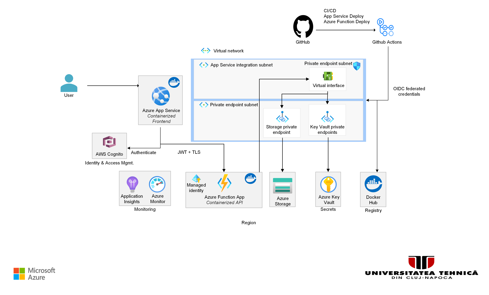

# TUCN-CC Azure Infrastructure

OpenTofu infrastructure for deploying the UTCN frontend and backend Docker images from Docker Hub to Azure App Service and Azure Functions, with managed identity and private networking concepts.

The default path is intentionally simple:

- local OpenTofu state
- local `tofu plan` / `tofu apply`
- manual infra deploys

Remote state in Azure Blob Storage is documented only as an optional bonus for later.

This infrastructure supports the companion application repository: [`TUCN_CC_Apps`](https://github.com/agi1clj/TUCN_CC_Apps).

App deployment from `TUCN_CC_Apps` can still be automated separately. This repo no longer runs infra through CI/CD, but it can optionally create GitHub OIDC access so the app repo can refresh the Azure container images after each push.

## Tutorial flow

Work through the repository in this order:

1. Read the [Architecture](#architecture) and [Network tutorial](#network-tutorial) sections.
2. Complete the one-time provider setup in [Azure subscription note](#azure-subscription-note).
3. Authenticate to Azure.
4. Fill in `environments/dev/terraform.tfvars`.
5. Follow [Tutorial](#tutorial) to deploy the infrastructure.
6. Use [Optional App Deploy Automation](#optional-app-deploy-automation) if you want pushes in `TUCN_CC_Apps` to update Azure automatically.
7. Use [Tear down](#tear-down) when the environment is no longer needed.

## Quick Start

Use this repository as the **first half** of the deployment tutorial.

The intended learning path is:

1. Read [Architecture](#architecture) and [Network tutorial](#network-tutorial).
2. Complete the one-time provider setup in [Azure subscription note](#azure-subscription-note).
3. Complete [Phase 1: Deploy the infrastructure](#phase-1-deploy-the-infrastructure).
4. Complete [Phase 2: Configure `TUCN_CC_Apps` for push-to-deploy](#phase-2-configure-tucn_cc_apps-for-push-to-deploy).
5. Complete [Phase 3: Verify the app deployment path](#phase-3-verify-the-app-deployment-path).

Follow the sections below in order and ignore the appendix-style material until the basic flow is working.

## Tutorial

### Phase 1: Deploy the infrastructure

1. Register the required Azure providers once by following [Azure subscription note](#azure-subscription-note).

2. Copy the variables file:

```bash
cp environments/dev/terraform.tfvars.example environments/dev/terraform.tfvars
```

3. Fill in at least:

- `student_suffix`
- `frontend_image_name`
- `frontend_image_tag`
- `backend_image_name`
- `backend_image_tag`
- `cognito_region`
- `cognito_user_pool_id`
- `cognito_client_id`
- `cognito_domain`
- `cors_origin` (placeholder is fine for the first apply)

4. Authenticate to Azure:

```bash
az login --use-device-code
az account set --subscription "<your-subscription-id>"
```

5. Initialize, plan, and apply:

```bash
./scripts/dev-init.sh
./scripts/dev-plan.sh
./scripts/dev-apply.sh
```

6. Read the outputs:

```bash
cd environments/dev
tofu output
tofu output frontend_url
tofu output backend_url
tofu output resource_group_name
tofu output app_service_name
tofu output function_app_name
```

7. Update `cors_origin` in `terraform.tfvars` to the real frontend URL and re-apply:

```hcl
cors_origin = "https://app-tucn-cc-dev-<suffix>.azurewebsites.net"
```

```bash
tofu apply
```

### Phase 2: Configure `TUCN_CC_Apps` for push-to-deploy

If you want pushes in `TUCN_CC_Apps` to update Azure automatically, enable the optional GitHub OIDC settings here:

```hcl
create_github_oidc  = true
github_organization = "your-github-owner"
github_repository   = "TUCN_CC_Apps"
```

Apply again if you changed those values:

```bash
./scripts/dev-apply.sh
```

Then read these outputs:

```bash
cd environments/dev
tofu output github_oidc_client_id
tofu output github_oidc_tenant_id
tofu output github_oidc_subscription_id
tofu output resource_group_name
tofu output app_service_name
tofu output function_app_name
tofu output frontend_url
tofu output backend_url
```

Use them to configure the `TUCN_CC_Apps` GitHub repository:

- Secrets:
  - `DOCKERHUB_USERNAME`
  - `DOCKERHUB_TOKEN`
- Variables:
  - `AZURE_CLIENT_ID`
  - `AZURE_TENANT_ID`
  - `AZURE_SUBSCRIPTION_ID`
  - `AZURE_RESOURCE_GROUP`
  - `AZURE_APP_SERVICE_NAME`
  - `AZURE_FUNCTION_APP_NAME`
  - `REACT_APP_API_BASE`
  - `REACT_APP_COGNITO_AUTHORITY`
  - `REACT_APP_COGNITO_CLIENT_ID`
  - `REACT_APP_COGNITO_DOMAIN`
  - `REACT_APP_OIDC_REDIRECT_URI`
  - `REACT_APP_OIDC_SCOPE`
  - `REACT_APP_LOGOUT_URI`

Recommended values:

- `REACT_APP_API_BASE` = `backend_url`
- `REACT_APP_OIDC_REDIRECT_URI` = `frontend_url`
- `REACT_APP_LOGOUT_URI` = `frontend_url`
- `AZURE_RESOURCE_GROUP` = `resource_group_name`
- `AZURE_APP_SERVICE_NAME` = `app_service_name`
- `AZURE_FUNCTION_APP_NAME` = `function_app_name`

### Phase 3: Verify the app deployment path

After the infrastructure is up and the GitHub settings are in place:

1. Go to `TUCN_CC_Apps`.
2. Make a small commit on `main`.
3. Let `.github/workflows/docker-publish.yml` run.
4. Verify that:
   - new Docker Hub `sha-*` tags were pushed
   - Azure App Service was updated
   - Azure Function App was updated
   - the smoke checks passed

### Phase 4: Clean up

When the lab ends:

```bash
./scripts/dev-destroy.sh
```

This repo is designed for a lab setup:

- one resource group
- one dev environment
- one shared App Service Plan
- low operational overhead
- easy teardown
- no mandatory remote backend bootstrap

Set a short unique `student_suffix` such as `agi`, `ab`, or `g1` in `terraform.tfvars` so resource names stay distinct inside the same subscription.

## Architecture



**How traffic flows at runtime**

1. User traffic can use public ingress on `*.azurewebsites.net` or private ingress through the App Service / Function App private endpoints.
2. Frontend outbound traffic and Function App outbound traffic use regional VNet integration on `snet-appservice`.
3. Function App can use the Storage and Key Vault private endpoints from inside the VNet, while the default mode keeps public access enabled for easier provisioning from a laptop.
4. Private DNS resolves Storage and Key Vault names to private IPs inside the VNet. App Service / Function App private DNS is only needed in the advanced full-private variant.
5. The shared user-assigned managed identity resolves Key Vault references at runtime.

**Why VNet Integration + Private Endpoints**

- VNet Integration (`snet-appservice`) gives App Service and Function App an outbound NIC inside the VNet. With `vnet_route_all_enabled = true`, all outbound traffic (including DNS) is routed through the VNet.
- Private Endpoints (`snet-pe`) inject a virtual NIC with a private IP for each PaaS service. Storage, Key Vault, App Service, and Function App can all be reached privately.
- Private DNS Zones override public DNS resolution inside the VNet: `mystorageaccount.blob.core.windows.net` → `10.0.2.x` instead of a public IP.

## Network tutorial

The network has only two subnets, and each one has a distinct job:

### `snet-appservice`

This subnet is for VNet integration only.

- The frontend App Service and backend Function App attach here for outbound traffic.
- This subnet is delegated to `Microsoft.Web/serverFarms`.
- App Service and Function App do not get private endpoints in this subnet.
- When `vnet_route_all_enabled = true`, outbound traffic goes through this subnet before reaching private endpoints or other network destinations.

Think of this subnet as the "exit lane" for the applications.

### `snet-pe`

This subnet is for private endpoints only.

- Storage Blob private endpoint lives here.
- Storage File private endpoint lives here.
- Key Vault private endpoint lives here.
- Frontend App Service private endpoint lives here.
- Backend Function App private endpoint lives here.

Think of this subnet as the "private doors" subnet. Each Azure PaaS service gets a private IP here.

### Why two subnets?

Azure App Service VNet integration and Azure Private Endpoints should not share the same subnet. They solve different problems:

- VNet integration is for outbound traffic from the app.
- Private endpoint is for inbound private access to a service.

That separation is what makes the design easy to explain in a networking laboratory:

1. App leaves through `snet-appservice`.
2. DNS resolves a PaaS hostname to a private IP.
3. Traffic reaches the service through the private endpoint NIC in `snet-pe`.

### DNS behavior

Without private DNS, the app would still resolve Azure service names to public IPs. The private endpoint alone is not enough.

In this repo:

- `privatelink.blob.core.windows.net` handles Storage Blob.
- `privatelink.file.core.windows.net` handles Storage File.
- `privatelink.vaultcore.azure.net` handles Key Vault.
- `privatelink.azurewebsites.net` handles App Service and Function App in the advanced full-private variant.

The VNet is linked to these zones, so anything using Azure-provided DNS from inside the VNet gets the private IP instead of the public one.

## Cost notes

- The hard floor is the shared Linux App Service Plan. `B1` is the cheapest practical SKU for this design because it supports custom containers and VNet integration.
- Private endpoints are the main cost driver.
- The default setup keeps public access enabled for App Service, Function App, Storage, and Key Vault, while still creating private endpoints for Storage and Key Vault.
- The advanced full-private variant adds App Service and Function App private endpoints.
- When both app private endpoints are disabled, the repo also skips the App Service private DNS zone resources automatically.
- `log_retention_days = 30` is already the lowest workspace-level retention to use here. Lowering it further is not the main cost lever.
- Verify final pricing in the Azure Pricing Calculator for your exact region before deploying.

### Default Mode

This repository now defaults to:

- App Service public access: enabled
- Function App public access: enabled
- Storage public access: enabled
- Key Vault public access: enabled
- Storage private endpoints: enabled
- Key Vault private endpoint: enabled
- App Service / Function App private endpoints: disabled

This keeps the important networking concepts without breaking local OpenTofu runs from a public laptop:

- Storage and Key Vault still have private endpoints and private DNS.
- The applications still use VNet integration for outbound traffic.
- The frontend and backend remain reachable over their public `*.azurewebsites.net` endpoints.
- OpenTofu can still create Key Vault secrets and finish Storage provisioning from the local machine.

For this same reason, the baseline lab flow keeps infra deployment local and simple.

Use this in `environments/dev/terraform.tfvars`:

```hcl
frontend_public_network_access_enabled = true
backend_public_network_access_enabled  = true
storage_public_network_access_enabled  = true
key_vault_public_network_access_enabled = true
enable_frontend_private_endpoint = false
enable_backend_private_endpoint  = false
```

This is the recommended default when:

- deployments run from local laptops
- the lab is short-lived
- reliable destroy/recreate cycles matter

### Advanced Full-Private Variant

If you want the full-private ingress variant for an instructor demo or a runner inside Azure, set:

```hcl
enable_frontend_private_endpoint = true
enable_backend_private_endpoint  = true
```

That is a better architecture demonstration, but it is not the best default when running OpenTofu from public laptops.

## State

### Default

Keep:

- local backend state in `environments/dev/terraform.tfstate`
- local infra runs from the same laptop that created the environment

This is acceptable because the environment is short-lived and can be destroyed from the same machine later.

### Optional upgrade: Azure Blob remote state

Use Blob-backed remote state when:

- more than one person needs to manage the same environment
- you need persistent state across runner machines
- you want state locking and safer shared workflows

The repository keeps `backend "local"` as the default so the lab works out of the box, but you can switch to AzureRM backend when needed.

1. Create a dedicated storage account and container for state.
2. Copy `environments/dev/backend.azurerm.hcl.example` to `environments/dev/backend.azurerm.hcl`.
3. Fill in the real storage account details.
4. Re-run init with backend migration:

```bash
./scripts/dev-init.sh -backend-config=backend.azurerm.hcl -migrate-state
```

After that, any future shared workflow can point at the same state file.

## Optional App Deploy Automation

If you want pushes in `TUCN_CC_Apps` to update the running Azure App Service and Function App automatically, enable the optional GitHub OIDC settings in `environments/dev/terraform.tfvars`:

```hcl
create_github_oidc  = true
github_organization = "your-github-org"
github_repository   = "TUCN_CC_Apps"
```

Apply once:

```bash
./scripts/dev-apply.sh
```

Then read these outputs:

```bash
cd environments/dev
tofu output github_oidc_client_id
tofu output github_oidc_tenant_id
tofu output github_oidc_subscription_id
tofu output resource_group_name
tofu output app_service_name
tofu output function_app_name
```

Add them in the `TUCN_CC_Apps` GitHub repository:

- Secrets:
  - `DOCKERHUB_USERNAME`
  - `DOCKERHUB_TOKEN`
- Variables:
  - `AZURE_CLIENT_ID`
  - `AZURE_TENANT_ID`
  - `AZURE_SUBSCRIPTION_ID`
  - `AZURE_RESOURCE_GROUP`
  - `AZURE_APP_SERVICE_NAME`
  - `AZURE_FUNCTION_APP_NAME`
  - `REACT_APP_API_BASE`
  - `REACT_APP_COGNITO_AUTHORITY`
  - `REACT_APP_COGNITO_CLIENT_ID`
  - `REACT_APP_COGNITO_DOMAIN`
  - `REACT_APP_OIDC_REDIRECT_URI`
  - `REACT_APP_OIDC_SCOPE`
  - `REACT_APP_LOGOUT_URI`

After that, pushes to `main` in `TUCN_CC_Apps` can build new Docker images, publish them, update Azure, and run basic smoke checks.

### Monitoring cost note

For this repository, keep:

```hcl
log_retention_days = 30
```

That is already the low-retention setting to use at the workspace level for this lab.

If you need to reduce monitoring cost, focus on:

- reducing log volume
- avoiding extra diagnostic settings you do not need
- destroying the environment when the lab ends
- disabling app private endpoints before changing monitoring design


## Repository layout

```
TUCN_CC_Apps_Infra/
├── modules/
│   ├── networking/        VNet, subnets, private DNS zones + VNet links
│   ├── identity/          User-assigned managed identity
│   ├── storage/           Storage account + blob/file private endpoints + RBAC
│   ├── key-vault/         Key Vault + secrets + vault private endpoint + RBAC
│   ├── monitoring/        Log Analytics workspace + Application Insights
│   ├── app-service/       App Service Plan (B1) + Linux Web App (frontend container)
│   └── function-app/      Linux Function App (backend container)
├── scripts/
│   ├── dev-init.sh
│   ├── dev-plan.sh
│   ├── dev-apply.sh
│   └── dev-destroy.sh
└── environments/
    └── dev/
        ├── providers.tf               azurerm ~> 4.66, random ~> 3.8
        ├── backend.tf                 Local state default
        ├── backend.azurerm.hcl.example Optional Azure Blob backend config
        ├── variables.tf               All input declarations with descriptions
        ├── main.tf                    Root module wiring all sub-modules together
        ├── outputs.tf                 URLs and names printed after apply
        └── terraform.tfvars.example   Copy to terraform.tfvars and fill in values
```

## Project governance

- Contributing guide: [CONTRIBUTING.md](CONTRIBUTING.md)
- Code of conduct: [CODE_OF_CONDUCT.md](CODE_OF_CONDUCT.md)
- Security policy: [SECURITY.md](SECURITY.md)
- Support policy: [SUPPORT.md](SUPPORT.md)

## Prerequisites

| Tool | Version | Install |
|------|---------|---------|
| OpenTofu | 1.11.x | `brew install opentofu` |
| Azure CLI | ≥ 2.60 | `brew install azure-cli` |
| Docker Hub account | — | hub.docker.com |
| Azure subscription | — | portal.azure.com |

Login to Azure before running any tofu command:

```bash
az login
az account set --subscription "<your-subscription-id>"
```

If browser login is inconvenient in the lab, use device code login:

```bash
az login --use-device-code
az account list --output table
az account set --subscription "<subscription-id-or-name>"
az account show --output table
```

If you are already authenticated and only need the current subscription ID:

```bash
az account show --query id --output tsv
```

### Azure subscription note

On restricted Azure subscriptions, do not rely on automatic Azure Resource Provider registration from OpenTofu. This repository disables broad automatic registration and expects only the providers that are actually needed to be registered:

```bash
az provider register --namespace Microsoft.Web
az provider register --namespace Microsoft.Network
az provider register --namespace Microsoft.Storage
az provider register --namespace Microsoft.KeyVault
az provider register --namespace Microsoft.Insights
az provider register --namespace Microsoft.OperationalInsights
az provider register --namespace Microsoft.ManagedIdentity
```

These are the exact providers used by this repository:

| Provider | Why it is needed in this lab |
|----------|-------------------------------|
| `Microsoft.Web` | App Service Plan, frontend App Service, backend Function App |
| `Microsoft.Network` | Virtual Network, subnets, private endpoints, private DNS zones |
| `Microsoft.Storage` | Storage Account |
| `Microsoft.KeyVault` | Key Vault |
| `Microsoft.Insights` | Application Insights |
| `Microsoft.OperationalInsights` | Log Analytics Workspace |
| `Microsoft.ManagedIdentity` | User-assigned managed identity |

Then verify they are registered:

```bash
for ns in Microsoft.Web Microsoft.Network Microsoft.Storage Microsoft.KeyVault Microsoft.Insights Microsoft.OperationalInsights Microsoft.ManagedIdentity; do
  echo -n "$ns: "
  az provider show --namespace "$ns" --query registrationState -o tsv
done
```

Expected result:

- every provider should show `Registered`

After that, run `tofu plan` again.

## First deploy

### Step 1: Prepare variables

Copy the example variables file:

```bash
cp environments/dev/terraform.tfvars.example environments/dev/terraform.tfvars
$EDITOR environments/dev/terraform.tfvars
```

Fill in at least:

- `student_suffix`
- frontend image name and initial tag
- backend image name and initial tag
- Cognito region
- Cognito user pool ID
- Cognito client ID
- initial `cors_origin`

For the first apply, `cors_origin` can be a placeholder. After deployment you update it with the real frontend URL.

### Step 2: Authenticate to Azure

```bash
az login --use-device-code
az account set --subscription "<your-subscription-id>"
```

### Step 3: Initialize OpenTofu

```bash
./scripts/dev-init.sh
```

### Step 4: Review the execution plan

```bash
./scripts/dev-plan.sh
```

Check that the plan creates:

- one resource group
- one virtual network
- two subnets
- one storage account
- one blob container (`datasets`) inside that storage account
- one key vault
- one shared Linux App Service Plan
- one frontend App Service
- one backend Function App
- private endpoints and private DNS zones

Also check that resource names include your chosen suffix, for example:

- `rg-tucn-cc-dev-agi`
- `app-tucn-cc-dev-agi`
- `func-tucn-cc-dev-agi`

### Step 5: Apply the infrastructure

```bash
./scripts/dev-apply.sh
```

### Step 6: Read the outputs

```bash
cd environments/dev
tofu output
tofu output frontend_url
tofu output backend_url
```

### Step 7: Fix CORS with the real frontend URL

The frontend URL is only known after the first apply:

```bash
tofu output frontend_url
```

Update `environments/dev/terraform.tfvars` with that value:

```hcl
cors_origin = "https://app-tucn-cc-dev-agi.azurewebsites.net"
```

Re-apply:

```bash
tofu apply
```

### Step 8: Verify in Azure

In the Azure portal, check:

1. Resource Group: all resources are inside `rg-tucn-cc-dev-<suffix>`.
2. Virtual Network: two subnets exist.
3. Private Endpoints: three private endpoints exist in the default mode, and five exist in the advanced full-private variant.
4. App Service and Function App: containers are configured from Docker Hub.
5. Key Vault: public network access is enabled in the default mode.
6. Storage Account: public network access is enabled in the default mode.
7. Storage Account → Containers: a container named `datasets` exists.
8. Function App → Configuration: `STORAGE_ACCOUNT_NAME` and `DATASETS_CONTAINER_NAME` are present in the application settings.

## Updating container images

When you publish new frontend or backend images to Docker Hub, update Azure to point to the new tags:

```bash
az webapp config container set \
  --name app-tucn-cc-dev-agi \
  --resource-group rg-tucn-cc-dev-agi \
  --docker-custom-image-name myuser/tucn-cc-frontend:sha-abc1234

az functionapp config container set \
  --name func-tucn-cc-dev-agi \
  --resource-group rg-tucn-cc-dev-agi \
  --docker-custom-image-name myuser/tucn-cc-backend-api:sha-abc1234

az webapp restart --name app-tucn-cc-dev-agi --resource-group rg-tucn-cc-dev-agi
az functionapp restart --name func-tucn-cc-dev-agi --resource-group rg-tucn-cc-dev-agi
```

For public Docker Hub images, `dockerhub_username` and `dockerhub_password` are optional and can be omitted from `terraform.tfvars`.

In the default path, Storage and Key Vault keep their private endpoints, but public network access remains enabled by default. That is intentional: OpenTofu is running from your laptop, not from inside the VNet, and the provider needs public data-plane reachability to create Key Vault secrets and finish Storage provisioning.

If your subscription rejects a deployment with `RequestDisallowedByAzure`, your selected Azure region is blocked by policy. Check the effective region restriction policy with:

```bash
az policy assignment list --query "[].{name:name, displayName:displayName, parameters:parameters}" -o json
```

Then update `location` in `environments/dev/terraform.tfvars` to one of the policy-allowed region names, such as `francecentral`, `swedencentral`, or `germanywestcentral`.

### Troubleshooting

- `RequestDisallowedByAzure` means the selected `location` is blocked by subscription policy. Use the policy assignment command above and choose one of the allowed region names.
- `ForbiddenByConnection` while creating Key Vault secrets means Key Vault was private-only while OpenTofu was running from a public laptop. In the default mode, keep `key_vault_public_network_access_enabled = true`.
- Storage or Key Vault errors during local applies usually mean public access was disabled too early. In the default mode, keep `storage_public_network_access_enabled = true` and `key_vault_public_network_access_enabled = true`.

## Study links

These are the primary Microsoft Learn references for the concepts used in this lab:

- App Service VNet integration:
  https://learn.microsoft.com/en-us/azure/app-service/overview-vnet-integration
- App Service private endpoints:
  https://learn.microsoft.com/en-us/azure/app-service/networking/private-endpoint
- Azure Functions private endpoints and VNet tutorial:
  https://learn.microsoft.com/en-us/azure/azure-functions/functions-create-vnet
- Azure Functions Linux container concepts:
  https://learn.microsoft.com/en-us/azure/azure-functions/container-concepts
- Private endpoint DNS behavior:
  https://learn.microsoft.com/en-us/azure/private-link/private-endpoint-dns
- Private endpoint overview:
  https://learn.microsoft.com/en-us/azure/private-link/private-endpoint-overview

Suggested reading order:

1. Private endpoint overview
2. App Service VNet integration
3. App Service private endpoint
4. Azure Functions private endpoint tutorial
5. Private endpoint DNS

Questions to answer after reading:

1. Why does VNet integration need a different subnet than private endpoints?
2. Why is a private DNS zone required?
3. What traffic is inbound through a private endpoint and what traffic is outbound through VNet integration?
4. Why can public network access stay enabled or be disabled independently of the private endpoint?
5. Why is the shared managed identity used for Key Vault access at runtime?

## Tear down

Everything is in one resource group — deleting it removes all resources and stops all billing.

**Via OpenTofu (clean state):**
```bash
./scripts/dev-destroy.sh
```

**Via Azure CLI (nuclear option, no state needed):**
```bash
az group delete --name rg-tucn-cc-dev-agi --yes --no-wait
```

## Networking lab exercises

| Exercise | What to observe |
|----------|----------------|
| Deploy and check private endpoint DNS | `nslookup <storage>.blob.core.windows.net` from inside a VM in the VNet should return `10.0.2.x` |
| Remove VNet DNS zone link and retry | Name resolution falls back to public IP — private endpoint becomes unreachable |
| Check Key Vault references in Function App | Portal → Function App → Configuration → show the resolved value of `COGNITO_REGION` |
| Review NSG flow logs | Add an NSG to `snet-pe`, enable flow logs → observe traffic from App Service to Storage |
| Scale up the plan | Change `app_service_plan_sku = "P0v3"` and re-apply to zero-downtime upgrade |


## Dataset blob container

The storage module provisions a private blob container named `datasets` inside the same storage account used by the Function App runtime.

> **If you already deployed the infrastructure before this feature was added**, run `tofu apply` again from `environments/dev/` to create the container and update the Function App environment variables. No variable changes are required — the defaults are applied automatically.

Two environment variables are injected into the Function App automatically:

| Variable | Value |
|----------|-------|
| `STORAGE_ACCOUNT_NAME` | Name of the storage account (e.g. `sttucnccdevagi3x7k2f`) |
| `DATASETS_CONTAINER_NAME` | `datasets` |

The managed identity already holds `Storage Blob Data Owner` on the storage account. No connection string or secret is needed.

### Uploading a CSV

Use the Azure Portal — no CLI auth or key needed:

1. Go to the Azure Portal → **Storage accounts** → `<STORAGE_ACCOUNT_NAME>`.
2. Click **Containers** in the left menu.
3. Click the **`datasets`** container.
4. Click **Upload** → select your `.csv` file → click **Upload**.

### Reading the CSV in Function App code (Node.js)

Install the required packages in `TUCN_CC_Apps`:

```bash
npm install @azure/storage-blob @azure/identity
```

Then in your function:

```js
const { BlobServiceClient } = require("@azure/storage-blob");
const { DefaultAzureCredential } = require("@azure/identity");

async function readDatasetCsv(blobName) {
  const accountName = process.env.STORAGE_ACCOUNT_NAME;
  const containerName = process.env.DATASETS_CONTAINER_NAME;

  const client = new BlobServiceClient(
    `https://${accountName}.blob.core.windows.net`,
    new DefaultAzureCredential()
  );

  const containerClient = client.getContainerClient(containerName);
  const blobClient = containerClient.getBlobClient(blobName);

  const downloadResponse = await blobClient.download();
  const chunks = [];
  for await (const chunk of downloadResponse.readableStreamBody) {
    chunks.push(chunk);
  }
  return Buffer.concat(chunks).toString("utf-8");
}
```

`DefaultAzureCredential` picks up `AZURE_CLIENT_ID` automatically, so it uses the user-assigned managed identity without any extra configuration.

### Why managed identity and not a connection string

- No secret to rotate or leak.
- `Storage Blob Data Owner` is already assigned by the storage module — no manual portal steps.
- Works inside the VNet: the Function App reaches the storage account through the private endpoint.

## Secrets management reference

| Secret | Where stored | How accessed |
|--------|-------------|--------------|
| Cognito User Pool ID | Azure Key Vault | `@Microsoft.KeyVault(...)` in Function App app settings |
| Cognito Client ID | Azure Key Vault | same |
| CORS origin | Azure Key Vault | same |
| Storage access key (runtime host) | OpenTofu state (sensitive) | directly in `azurerm_linux_function_app.storage_account_access_key` — used by the Functions host, not by application code |
| Dataset blob access | managed identity (`Storage Blob Data Owner` RBAC) | `DefaultAzureCredential` in function code — no key or secret needed |
| Docker Hub PAT | GitHub Secret or local env var, only if images are private | not required for public images |
